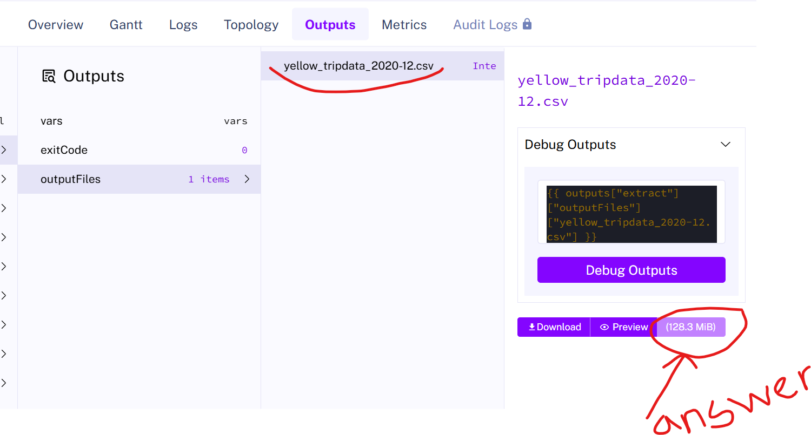

<h1>Quiz Questions</h1>
1- Within the execution for Yellow Taxi data for the year 2020 and month 12: what is the uncompressed file size (i.e. the output file yellow_tripdata_2020-12.csv of the extract task)? 
1- 128.3 MB 
2- 134.5 MB 
3- 364.7 MB 
4- 692.6 MB  

**ANSWER: 1**
  

  

----------------------------------------------------------------------------------------------
2- What is the rendered value of the variable file when the inputs taxi is set to green, year is set to 2020, and month is set to 04 during execution? 
1- {{inputs.taxi}}_tripdata_{{inputs.year}}-{{inputs.month}}.csv 
2- green_tripdata_2020-04.csv 
3- green_tripdata_04_2020.csv 
4- green_tripdata_2020.csv 

we need just to substitute the values `green`,`2020`, and`04` respectively with the`inputs.taxi`,`inputs.year`, and`inputs.month`in the expression`{{inputs.taxi}}_tripdata_{{inputs.year}}-{{inputs.month}}.csv`. we will get green_tripdata_2020-04.csv as the result.

**ANSWER: 2**
 

----------------------------------------------------------------------------------------------
3- How many rows are there for the Yellow Taxi data for all CSV files in the year 2020? 
1- 13,537.299 
2- 24,648,499 
3- 18,324,219 
4- 29,430,127 

