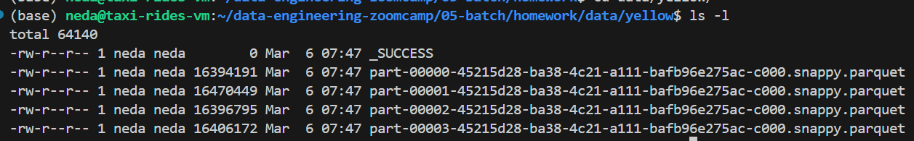

<h2>Question 1: Install Spark and PySpark</h2>
1- Install Spark <br>
2- Run PySpark<br>
3- Create a local spark session<br>
4- Execute spark.version.<br><br>
What's the output?<br>

```python
pyspark.__version__
```

**answer: 3.5.5**
_____________________________________________________________________________________
<h2>Question 2: Yellow October 2024</h2>
Read the October 2024 Yellow into a Spark Dataframe.<br>

Repartition the Dataframe to 4 partitions and save it to parquet.<br>

What is the average size of the Parquet (ending with .parquet extension) Files that were created (in MB)? Select the answer which most closely matches.<br><br>

1- 6MB<br>
2- 25MB<br>
3- 75MB<br>
4- 100MB<br>

**ANSWER: 2**
<br><br>


<br><br>


