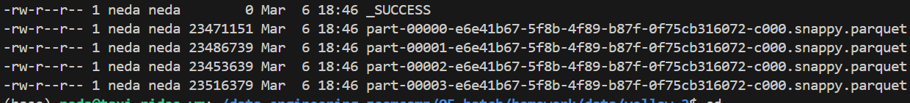

<h2>Question 1: Install Spark and PySpark</h2>
1- Install Spark <br>
2- Run PySpark<br>
3- Create a local spark session<br>
4- Execute spark.version.<br><br>
What's the output?<br>

```python
pyspark.__version__
```

**answer: 3.5.5**
_____________________________________________________________________________________
<h2>Question 2: Yellow October 2024</h2>
Read the October 2024 Yellow into a Spark Dataframe.<br>

Repartition the Dataframe to 4 partitions and save it to parquet.<br>

What is the average size of the Parquet (ending with .parquet extension) Files that were created (in MB)? Select the answer which most closely matches.<br><br>

1- 6MB<br>
2- 25MB<br>
3- 75MB<br>
4- 100MB<br>


```python
df_spark = spark.read.parquet('yellow_tripdata_2024-10.parquet', header=True)
df_spark = df_spark.repartition(4)
df_spark.write.parquet("data/yellow/")
```


<br><br>
**ANSWER: 2**

 _____________________________________________________________________
<h2>Question 3: Count records</h2>
How many taxi trips were there on the 15th of October?<br>

Consider only trips that started on the 15th of October.<br><br>

1- 85,567<br>
2- 105,567<br>
3- 125,567<br>
4- 145,567<br>

```python
from pyspark.sql import functions as F
from pyspark.sql.functions import col

# Assuming you want to cast the 'tpep_pickup_datetime' column to timestamp
df_spark = df_spark.withColumn("pickup_date", F.to_date(df_spark.tpep_pickup_datetime))
df_spark = df_spark.withColumn("dropoff_date", F.to_date(df_spark.tpep_dropoff_datetime))

df_spark.filter(df_spark.pickup_date == "2024-10-15").count()
```
**ANSWER: 3**
