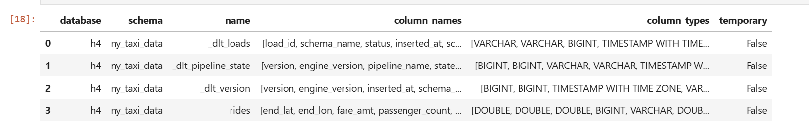
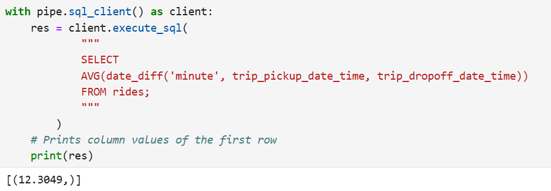

<h2>Question 1: dlt Version</h2>

dlt --version<br>
**ANSWER: dlt 1.5.0**<br>

-------------------------------------------------------------------------------------------
<h2>Question 2: dlt Version</h2>

How many tables were created?<br><br>

1- 2<br>
2- 4<br>
3- 6<br>
4- 8<br>


```python
import dlt
from dlt.sources.helpers.rest_client import RESTClient
from dlt.sources.helpers.rest_client.paginators import PageNumberPaginator

@dlt.resource(name="rides")
def extract_data_gen():
    client = RESTClient(
        base_url="https://us-central1-dlthub-analytics.cloudfunctions.net",
        paginator=PageNumberPaginator(
            base_page=1,
            total_path=None
        )
    )
    
    for page in client.paginate("data_engineering_zoomcamp_api"):
        yield page

pipe = dlt.pipeline(
    pipeline_name="H4",
    destination="duckdb", 
    dataset_name="ny_taxi_data"
)

load_info = pipe.run(extract_data_gen)
print(load_info)

import duckdb
conn = duckdb.connect(f"{pipe.pipeline_name}.duckdb")
conn.sql(f"SET search_path = '{pipe.dataset_name}'")
conn.sql("DESCRIBE").df()
```
<br>


<br><br>

**ANSWER: 2**

----------------------------------------------------------------------------------------------
<h2>Question 3: Explore the loaded data</h2>
What is the total number of records extracted?<br><br>

1- 2500<br>
2- 5000<br>
3- 7500<br>
4- 10000<br>

```python
df = pipeline.dataset(dataset_type="default").rides.df()
df
# 10000 rows × 18 columns
```
<br><br>

**ANSWER: 4**

----------------------------------------------------------------------------------------------
<h2>Question 4: Trip Duration Analysis</h2>
    
What is the average trip duration?<br><br>

1- 12.3049<br>
2- 22.3049<br>
3- 32.3049<br>
4- 42.3049<br>



<br><br>

**ANSWER: 1**


