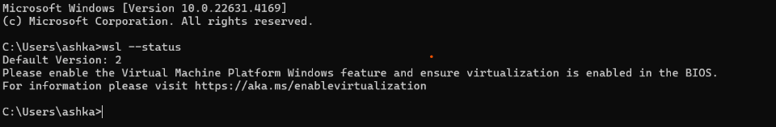
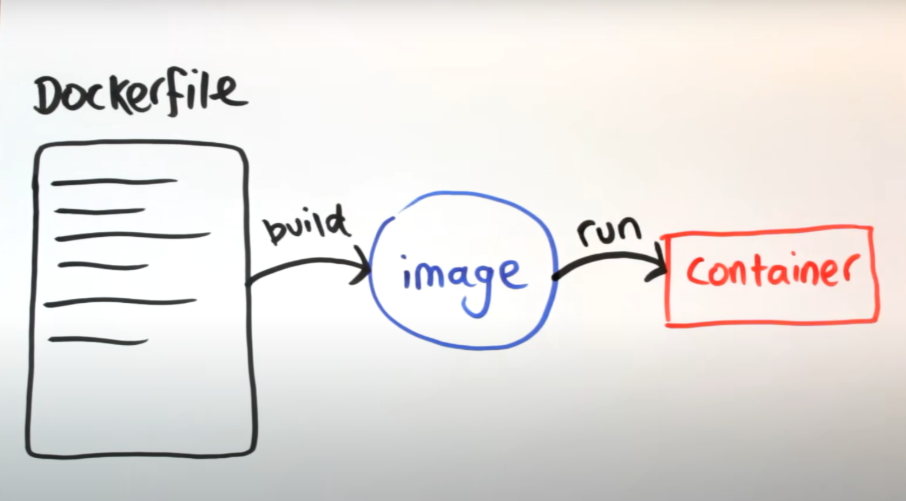

<h1>Module 1</h1>

what is Docker? It delivers **software** in packages called **container**. Containers are **isolated** from another one. 
Pipeline is a process or a service that takes in data and produces more data. In another hand, it is a means to transfer data from somewher to somewhere else. Along the way, data is transformed and optimized , arriving in a state that can be used by engineerings.The whole idea of docker for developer is to develop applocationes, ship them into containars and then run them anywhere.

<h2>why should we care about docker?</h2>
1- reproducibility

2- Local experiments

3- Integration test (CI/CD): to test a real complicated pipline locally to make sure what it is doing. so we can come up with a bunch of tests to make sure that its behaviour is what we expect. to get more information, you can look up something like GitHub action, and GitHub CI/CD.

<h2>installing Docker</h2>

 <h3>Useful links</h3>
1) (https://www.bing.com/videos/riverview/relatedvideo?q=how+to+install+docker+on+windows+11+youtube+video&mid=644C3A72ADF568CFFCA1644C3A72ADF568CFFCA1&FORM=VIRE)

2) Docker Home Page - https://www.docker.com/
4) Docker Windows Download Page - https://www.docker.com/products/docke...
5) Docker System Requirements - https://docs.docker.com/desktop/insta...
6) Step by Step Fix Manual - https://learn.microsoft.com/en-us/win...

<h3>Requirements</h3>
- In search box, type and open: “turn Windows features on or off” and check:<br>  
  - Check Windows hypervisor platform  <br>
  - Check Windows subsystem for Linux<br>
- Restart computer to complete the installation process if it asked.<br>
- After restarting computer, in CMD window type: wsl –status: I got following output:<br>



- Just to check the things are fine:<br>
  Wsl –update<br>
- Optional: To change the version of wsl, type in cmd: –set-default-version 2<br>
- Download docker from Windows | Docker Docs and install it. <br>
- After restarting, if you get following window, it means you have installed docker successfully. <br>


- Press accept and welcome to Docker.<br>
- To check if docker works correctly, run:<br>
  docker run hello-world  // hello-world is an docker image<br>

<h2>Useful Commands</h2>
  
  1- docker run -it ubuntu bash<br>
    ubuntu is the name of image we want to run, keyword "it" means interactive mode (we can write), ubuntu is the image we 
    wannw have locally, bash is the command we wanna execute in this image like a parameter. All things come after image 
    nam are parameters to this container. So in this command we say we want to execute a bash on the image Ubuntu so we get 
    this bash prompt.
  
  2- Docker run -it python:3.9:  to have python environment

  3- docker run -it --entrypoint=bash python:3.9: to install pandas on this specific container

  4- docker ps: List the running containers in your Docker environment: ps stands for “process status”

  5- Docker build -t test:pandas . : builds a Docker image  from a Dockerfile in the current directory (where the Dockerfile is located) and tags it with the name test and the version pandas. After the image is built, you can refer to it as test:pandas in subsequent Docker commands (like docker run). "." syas to save the image in the current directory.
  


There are lots of images in docker hub: hub.docker.com

—-- —----------------------------------------------

<h2>Creating a simple "data pipeline" in Docker</h2>

1- run an python image with pandas installed. what we want as output, once we are immediately in, is "hello world" to be written in terminal. <br>
create a file called Dockerfile and write the code below: <br>
```python
# Dockerfile
from python:latest

RUN  pip install pandas 
WORKDIR /app
COPY test.py test.py
ENTRYPOINT ["python", "test.py" ]
```
which test.py is a python file in which has been written `print("hello world!")`

2- parametrize Dockerfile: we want the docker to takes in a date in the running time and print it.<break>
we pass parameters to docker by the command `docker run -it docker_name parameter1 parameter2 parameter3` and the file `test.py` gets parameters by `sys.argv`:<break>
```python
# test.py
import pandas as pd 
import sys
print(sys.argv)
print(f"hello world!{sys.argv[1]}")
```

```python
docker run -it \
     -e POSTGRES_USER="root" \
     -e POSTGRES_PASSWORD="root" \
     -e POSTGRES_DB="ny_taxi" \
     -v $(pwd)/ny_taxi_postgres_data:/var/lib/postgresql/data \
     -p 5432:5432 \
     postgres:13   
```
# Run Postgres

[Watch Video](https://www.youtube.com/watch?v=2JM-ziJt0WI&list=PL3MmuxUbc_hJed7dXYoJw8DoCuVHhGEQb&index=5&feature=youtu.be)


1- run postgres in an interactive mode: <br>
```python
docker run -it \
     -e POSTGRES_USER="root" \
     -e POSTGRES_PASSWORD="root" \
     -e POSTGRES_DB="ny_taxi" \
     -v $(pwd)/ny_taxi_postgres_data:/var/lib/postgresql/data \
     -p 5432:5432 \
     postgres:13   
```
-e POSTGRES_USER : The name of our PostgreSQL user<br>
-e POSTGRES_PASSWORD : The password for our user<br>
-e POSTGRES_DB : The name we want for our database<br>
-v or volume is a way to map a folder in our filesystem in the host machine to a folder in the filesystem of the container. This defines an external volume, ensuring data persistence. By default, PostgreSQL stores data inside the container, which is lost when the container is removed. Mounting a volume syncs the container's internal folder with a specified local folder, allowing data to persist across container recreations. <br>
**To start an interactive shell session inside a container:** `docker exec -it docker_ID bash` <br>

2- Next up, we connect to the database using the command line that is specific for postgres **PGCLI**. I enterd the PostgreSQL port, database name, user, and localhost as the host to verify everything is working.<br>
 ```python
pgcli -h localhost -u root -p 5432 -d ny_taxi # to connect to postgres
```
3- Loading data into the database: here we will open jupyter notebook. because i installed anaconda, I already have jupyter notebook installed. I type jupyter notebook and it taks me to the jupyter. Because I am practicing all these stuff on the VM, after typing jupyter notebook, you will need to map ports of local system nad remote system. 

```python
# a simple pipline
import pandas as pd
import psycopg2
from sqlalchemy import create_engine, text
import os
from tqdm import tqdm

os.system('wget https://github.com/DataTalksClub/nyc-tlc-data/releases/download/green/green_tripdata_2019-10.csv.gz -P /home/neda/neda/dataSets')

# DEFINE THE DATABASE CREDENTIALS
user = 'root'
password = 'root'
host = 'localhost'
port = 5432
database = 'ny_taxi'
engine=create_engine(f"postgresql://{user}:{password}@{host}:{port}/{database}")

df_it = pd.read_csv("/home/neda/neda/dataSets/green_tripdata_2019-10.csv", iterator=True, chunksize=10000)
for chunk in tqdm(df_it):
    chunk.lpep_pickup_datetime = pd.to_datetime(chunk.lpep_pickup_datetime) # pandas recognizes lpep_pickup_datetime as text. We will use pd.to_datetime to change it.
    chunk.lpep_dropoff_datetime = pd.to_datetime(chunk.lpep_dropoff_datetime) # same as lpep_pickup_datetime
    chunk.to_sql(con=engine, name='green_tripdata_2019_10', if_exists="append")
```
# Connecting pgAdmin and Postgres

In this step, we want to interact with postgres by pgadmin wich is a web-based tool, and very user freindly. To connect these 2 dockers we need to connect them to the same `network`. first we create a network and then connect the dockers to it with the parameter`--network`.
```python
docker network create pg-network
```
run postgres and connect it to `pg-network` already created:
```python
docker run -it \
     -e POSTGRES_USER="root" \
     -e POSTGRES_PASSWORD="root" \
     -e POSTGRES_DB="ny_taxi" \
     -v $(pwd)/ny_taxi_postgres_data:/var/lib/postgresql/data \
     -p 5431:5432 \
     --network=pg-network \
     --name pg-database \
postgres:13
```
now run pgadmin and connect it to `pg-network`:
```pyrhon
docker run -it \
     -e PGADMIN_DEFAULT_EMAIL="admin@admin.com" \
     -e PGADMIN_DEFAULT_PASSWORD="root" \
     -p 8080:80 \
     --network=pg-network \
     --name pgadmin \
dpage/pgadmin4
```
